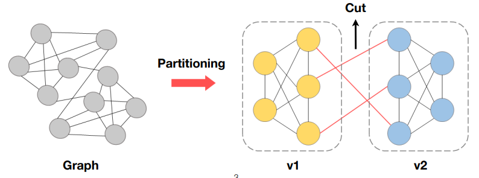
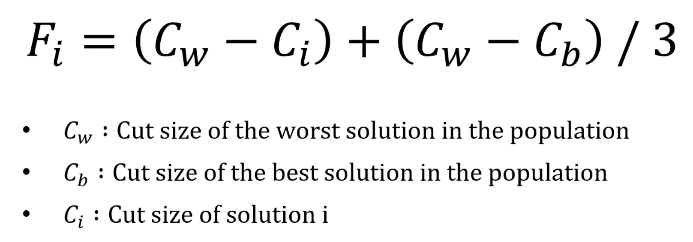
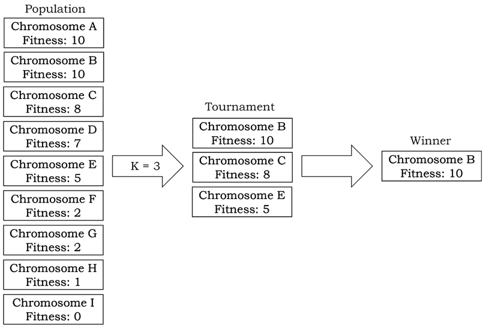
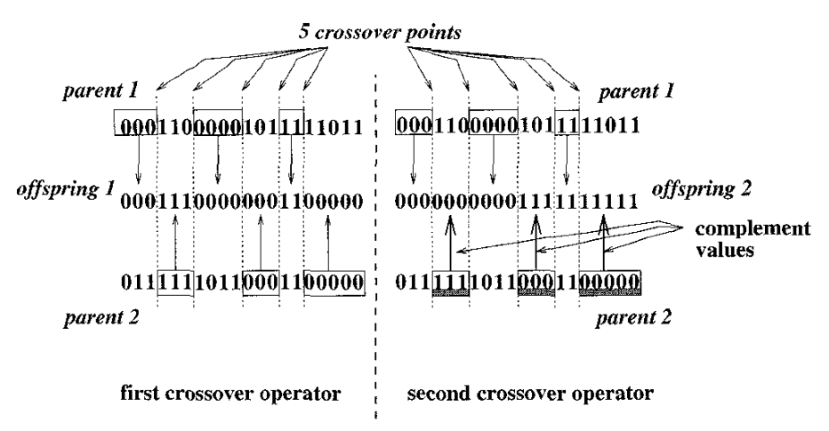
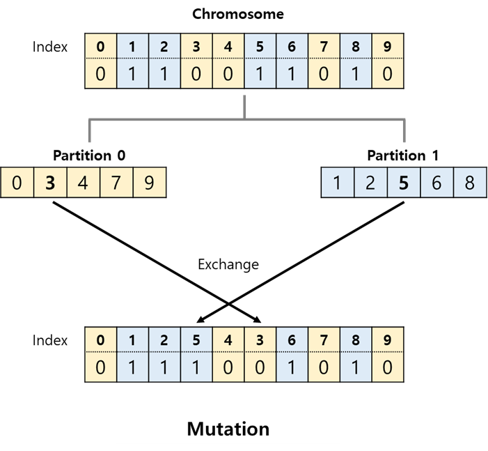
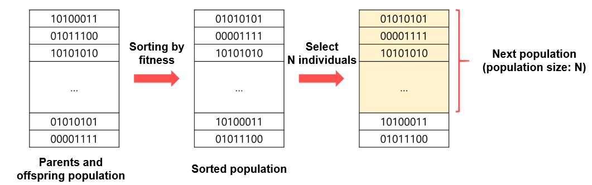

# Genetic Algorithm for Graph Partitioning

> ## a. Why this topic?
> Graph partioning is a one of the NP-complete combinatorial optimization problems. We can find many papers applying genetic algorithm to the graph partiioning problem.
> In here, I decided to apply the method from the journal paper **"Genetic Algorithm and Graph Partitioning" written by Thang Nguyen Bui and Byung Ro Moon.**
>
> * **Why Graph Partitioning is important?**
> 
>     1. Break down a large scale graph problem into smaller subproblems to be solved independently and in parallel
>     
>         → faster processing
>     2. Many real-world applications (ex. parallel processing, VLSI design)
>         * Google maps, where the partitioning algorithm is used to efficiently compute routes.
>
> (Paper link: https://ieeexplore.ieee.org/abstract/document/508322)
>
>
> ## b. What is the topic?
> **Graph partitioning.**
> 
> To given an undirected graph G = (V, E) where V is the set of n nodes and E is the set of edges between the nodes, it divides the graph into two disjoint subsets of nodes v1 and v2 so that the number of edges between the nodes in the different subsets is minimized, and the sizes of the subsets are equal.
>
> 
>
> ## c. Design decision
>> ### Parameters
> There are 5 parameters in the program.
> 
> * **POP_SIZE**
>     * Initial population size
>     * Type : INT
>     * Range : [1, INF)
>     
> * **NUM_NODES**
>     * The number of nodes in the graph which will be generated randomly.
>     * It should be an **even number**.
>     * Type : INT
>     * Range : [2, INF)
>
> * **CONNECT_PROB**
>     * The probability to connect two nodes with edge
>     * Type : FLOAT
>     * Range : [0., 1.)
>     
> * **MUT_PROB**
>     * The probability to execute mutation
>     * Type : FLOAT
>     * Range : [0., 1.)
>     
> * **STOPPING_COUNT**
>     * Stopping criteria
>     * If there is no improvement within STOPPING_COUNT times, the program will be terminated.
>     * Type : INT
>     * Range : (1, INF)
>
> * **K_IND**
>     * How many individuals are selected for the tournament
>     * Type : INT
>     * Range : [1, NUM_NODES)
> -----    
>> ### Stopping criteria
> * If there's **no improvement within 10 times**, the program will be terminated.
> * How many times you accept it without the improvement can be adjusted with the parameter _**STOPPING_COUNT**_.
> -----
>> ### Fitness function
> * Fitness of each individual will be calculated by the equation below.
> 
> 
> The cut is the set of edges between the partitions.
> 
> -----
>> ### Selection operator
> * **Tournament selection**
>     * Select k random individuals from the population and pick the best out of them
>     * random number k can be adjusted with the parameter _**K_IND**_
>     
>     
>     
>     (© https://medium.com/pragmatic-programmers/implementing-common-selection-strategies-37c6f99795a6)
> -----
>> ### Crossover operator
> **I replaced single point crossover to multi-point crossover.**  
> However, a single point crossover is still available.
> 
> * **Multi-point crossover**
>     * From the tournament selection, two chromosomes are selected as parents.
>     * 5 cut points for crossover are selected randomly
>     * Offspring 1 and 2 will be generated in **different way** (described in below image).
>     * If the partitions of new offspring don't have the same size, the offspring will be **discarded**
>
>     
>
> * ~~**Single point crossover**~~
>     * ~~From the tournament selection, two chromosomes are selected as parents.~~
>     * ~~The crossover point is selected randomly.~~
>     * ~~If the partitions of new offspring don't have the same size, the offspring will be **discarded**.~~
>
> -----
>> ### Mutation operator
> * Replace one node in a graph with a different, compatible type.
> * The node randomly chosen from partition 0 will be exchanged with the node randomly chosen from partition 1.
>
>
>
> -----
>> ### Generational selection strategy
> * **Elitism**
>     * Maintaining M best individuals from the parents' generation
>     
>     
> ## d. How to run the project.
> ```
> cd src
> python3 main.py
> ```
>> ### Requirements
> ```
> networkx
> numpy
> ```
>> **Installation**
>> ```
>> pip3 install networkx
>> pip3 install numpy
>> ```
> ## e. How to adjust parameters.
> Parameters are defined as global variables in main.py.
> ```
> POP_SIZE = 300 
> NUM_NODES = 100
> CONNECT_PROB = 0.1
> MUT_PROB = 0.3
> STOPPING_COUNT = 10
> K_IND = int(POP_SIZE * 0.1)
> ```
> You can adjust the parameters by modifying the values of them.
> 
